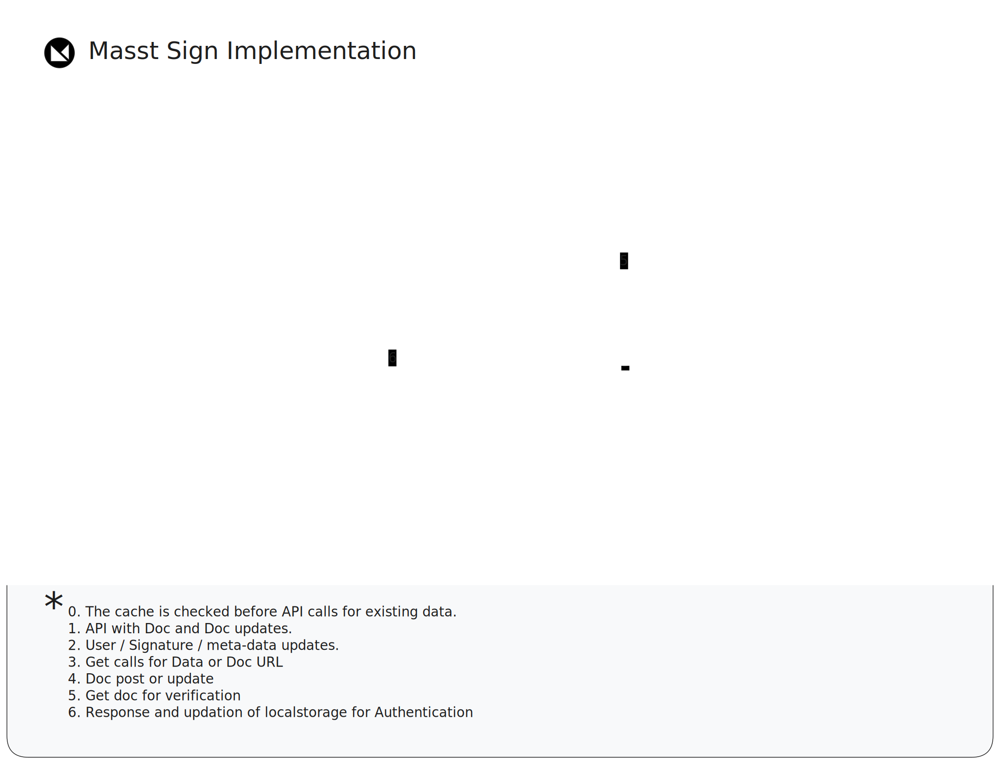
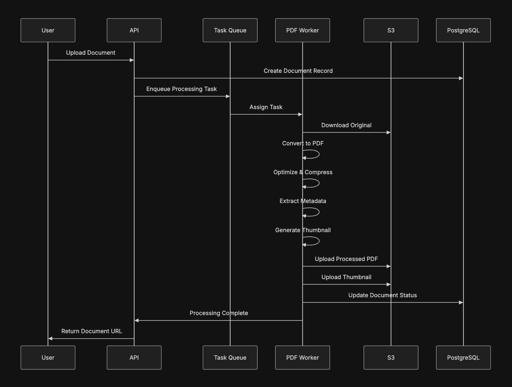
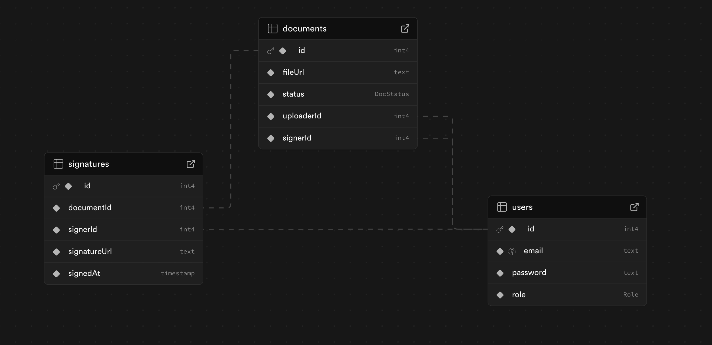
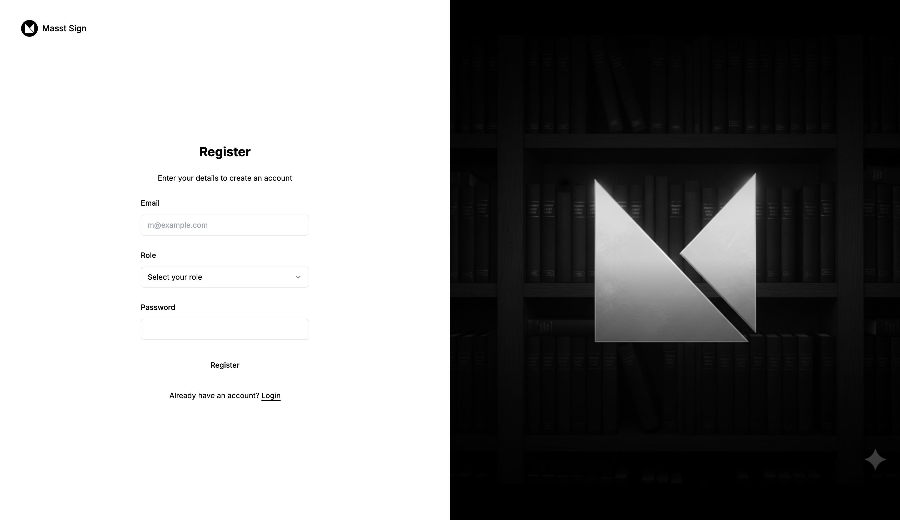

# 🖋️ MasstSign

### A modern, full-stack digital document signing platform — built for speed, security, and simplicity.

MasstSign lets users upload, assign, and digitally sign PDF documents with ease.  
It supports **role-based authentication**, **cloud storage**, and a **clean signing workflow** designed for real-world use.

---

## 🗺️ Architecture Diagram

A high-level view of MasstSign’s deployment and data flow:

flowchart LR
    subgraph Frontend["Frontend (Next.js)"]
        A1["User Interface"]
    end

    subgraph Backend["Backend (NestJS)"]
        B1["API Gateway"]
        B2["JWT Auth / Business Logic"]
    end

    subgraph Database["Database (Postgres / MongoDB)"]
        C1["User / Document / Signature Data"]
    end

    subgraph Storage["Cloudinary / AWS S3"]
        D1["PDF File Storage"]
    end

    %% Connections
    A1 -->|"HTTPS Requests / API Calls"| B1
    B1 -->|"Prisma / ORM Queries"| C1
    C1 -->|"Query Results"| B1
    B1 -->|"API Responses (JSON)"| A1

    B2 -->|"File Uploads / Downloads"| D1
    D1 -->|"File URLs / Metadata"| B2

    %% Styling
    classDef node fill:#111,stroke:#888,stroke-width:1px,color:#fff;
    classDef storage fill:#222,stroke:#888,stroke-width:1px,color:#fff;
    class A1,B1,B2,C1,D1 node;
    class D1 storage;

<!-- Optionally, you can add a graphical diagram for extra polish: -->


> **Legend:**  
> - **Frontend**: Next.js/React (UI, signing, JWT)  
> - **Backend**: NestJS (API, JWT auth, workflows)  
> - **Database**: PostgreSQL (users, docs, signatures)  
> - **Cloud Storage**: Cloudinary (PDFs, signed output)



---

## 🚀 Overview

MasstSign simplifies document signing through two user roles:

- **Uploader** – Uploads and assigns documents for signing.
- **Signer** – Views assigned documents and completes signing tasks.

The system ensures end-to-end security with JWT authentication and provides a smooth, intuitive signing experience with live canvas support.

---

## 🔄 Workflow Overview


  
**Workflow Summary:**
1. Uploader logs in → uploads PDF → assigns to signer.  
2. Signer logs in → signs document → submits.  
3. Uploader reviews → accepts or rejects the signed version.

## 🧩 Features

### 🔐 Authentication & Authorization
- Secure JWT-based authentication.
- Role-based access control:
  - **Uploader:** upload, assign, and verify documents.
  - **Signer:** view and sign assigned documents.

### 📤 Uploader Workflow
- Upload PDF documents (stored in **Cloudinary** or **AWS S3**).
- Optionally mark fields for:
  - Signature  
  - Name  
  - Email  
  - Date  
- Assign documents to a signer by email.
- Review completed signatures and **accept or reject** submissions.

### ✍️ Signer Workflow
- View all documents assigned to them.
- Complete signing fields:
  - Signature (via digital pad / canvas)
  - Name (manual input)
  - Email (pre-filled)
  - Date (auto-generated)
- Submit the signed document securely.

### ✅ Document Verification
- Signed documents are stored with full traceability.
- Uploaders can review, accept, or reject signed versions.

---

## 🧠 Soon

- 🤖 **AI Signature Detection:** Automatically detect likely signature areas in PDFs.  
- 🕒 **Audit Logging:** Record who signed, when, and document status.  
- 📊 **Dashboards:** WIP - Role-based stats (pending, signed, rejected). 
- 🧼 **Polished UI:** Minimal, responsive, and accessible design.

---

## 🧱 Tech Stack

| Layer | Technology |
|-------|-------------|
| **Frontend** | Next.js / React.js |
| **Backend** | NestJS (Node.js) |
| **Database** | PostgreSQL / MongoDB (via Prisma / Mongoose) |
| **Auth** | JWT (JSON Web Token) |
| **Storage** | Cloudinary / AWS S3 |
| **Styling** | TailwindCSS + ShadCN UI |
| **Optional AI** | OpenAI API / TensorFlow.js |

---

## 🧠 Implementation Details & Technical Depth

MasstSign is built as a **scalable, production-grade full-stack application**, going well beyond the base assignment requirements — with modern tooling, best practices, and strong developer experience.

---

### 🧩 Frontend (Next.js + TypeScript)

Developed with **Next.js 14**, **TypeScript**, and **TailwindCSS**, the frontend focuses on a fluid UX, maintainable structure, and performance optimization.

#### 🧱 Key Libraries & Enhancements

| Category | Library | Purpose |
|-----------|----------|----------|
| **Core Framework** | `next@14`, `react@18` | Routing, rendering, hydration |
| **Forms & Validation** | `formik`, `yup` | Form state management & validation |
| **Data Handling** | `axios`, `@tanstack/react-query` | Fetching, caching, and optimistic updates |
| **Auth Management** | `js-cookie`, `jwt-decode` | JWT storage & decoding |
| **Styling** | `tailwindcss`, `tailwind-merge`, `tailwind-variants`, `tailwindcss-animate` | Custom utilities & animations |
| **UI Library** | `shadcn-ui`, `@radix-ui/react-*`, `lucide-react` | Accessible, modern UI components |
| **DX Tools** | `eslint`, `autoprefixer`, `postcss` | Developer linting and build optimization |

#### 💎 Frontend Highlights
- **React Query** for efficient API synchronization.
- **Formik + Yup** for fully validated forms.
- **Role-aware routing** with persistent JWT sessions.
- **ShadCN + Radix-based UI** for accessibility and scalability.
- **Optimized Tailwind setup** for theme consistency and component variants.

---

### ⚙️ Backend (NestJS + Prisma + JWT)

The backend is powered by **NestJS**, following modular architecture with authentication, document management, and verification workflows.

#### 🧱 Key Libraries & Enhancements

| Category | Library | Purpose |
|-----------|----------|----------|
| **Core Framework** | `@nestjs/core`, `@nestjs/common`, `@nestjs/platform-express` | Modular backend structure |
| **Auth & Security** | `@nestjs/jwt`, `passport`, `passport-jwt`, `bcryptjs` | JWT & password encryption |
| **Database ORM** | `prisma`, `@prisma/client` | Type-safe schema & queries |
| **Config Management** | `@nestjs/config` | Environment-based configuration |
| **Testing** | `jest`, `supertest`, `ts-jest` | Unit and e2e tests |
| **Developer Tools** | `prettier`, `eslint`, `typescript-eslint` | Code formatting & linting |
| **Utilities** | `reflect-metadata`, `rxjs`, `cors` | Metadata, reactive streams, and CORS support |

#### 💎 Backend Highlights
- **JWT-based authentication** with role guards.  
- **Cloud storage** for PDFs (Cloudinary/S3).  
- **Prisma migrations and DB schema management.**  
- **Swagger-ready** API documentation (optional).  
- **Testing environment** using Jest and Supertest.  
- **Prettier + ESLint** for strict code style enforcement.  

---

### 🌐 Overall Architecture
- **Frontend (Next.js)** ↔ **Backend (NestJS)** communication secured via JWT.  
- **Prisma ORM** for safe database access.  
- **Cloudinary / AWS S3** handles all document storage.  
- **Role-based route guards** protect sensitive operations.  
- Easily **containerized / deployable** setup.

---

### 🧾 What’s Extra (Beyond the Basic Requirements)

✅ End-to-end **frontend ↔ backend integration** with real JWT auth  
✅ Fully configured **ShadCN UI** + Radix-based components  
✅ Production-ready **linting, formatting, and testing setup**  
✅ **React Query caching**, error states, and optimistic UI updates  
✅ Modular NestJS backend with Prisma ORM  
✅ AI-ready architecture for future auto-detection features  
✅ Strong **TypeScript typing** across all layers  

---

## 🗂️ Database Schema


  
> Includes collections/tables for **Users**, **Documents**, and **Signatures**.  

---

## 🧰 Setup & Installation

### ⚙️ Backend Setup

```bash
cd backend
npm install
```

Create a `.env` file:

```env
DATABASE_URL=your_database_url
JWT_SECRET=your_secret_key
CLOUDINARY_API_KEY=your_cloudinary_key
CLOUDINARY_API_SECRET=your_cloudinary_secret
CLOUDINARY_CLOUD_NAME=your_cloud_name
```

Run Prisma migrations:

```bash
npm run db:push
```

Start the backend:

```bash
npm run start:dev
```

---

### 💻 Frontend Setup

```bash
cd frontend
npm install
```

Create a `.env.local` file:

```env
NEXT_PUBLIC_API_URL=http://localhost:3000
```

Start the frontend:

```bash
npm run dev
```

> And you'll see.



---

---

## 🧾 API Documentation

WIP - You can import the Postman or Swagger collection for easy testing.

* **Swagger URL:** `/api/docs` *(if enabled in NestJS)*
* **Postman Collection:** `/docs/postman_collection.json`

---

## 🔐 Future Improvements

* Multi-signer and bulk document workflows.
* OTP-based signature verification.
* Real-time status updates via WebSockets.
* Blockchain verification for document integrity.
* Admin panel for managing users and roles.

---

## 🧑‍💻 Author

**Aditya Narayan**  
Creator of the **Masst Ecosystem** — elegant tools for developers.  
GitHub: [@yourusername](https://github.com/AdityaNarayan29/)

---

## 🪪 License

> MIT License © 2025 Aditya Narayan  
> Use and modify freely for educational or demo purposes.
